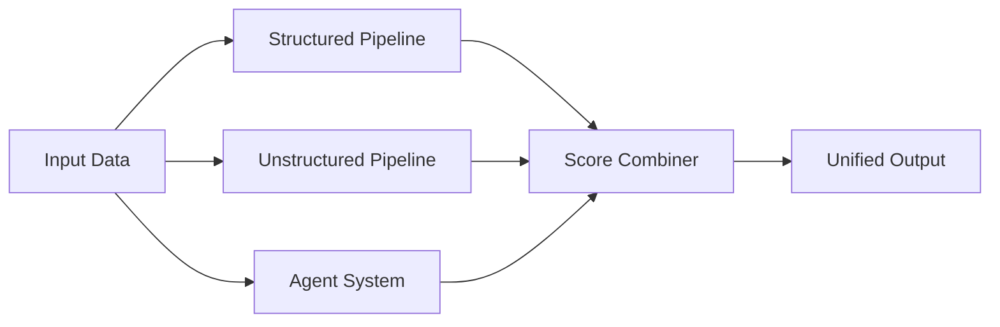

# 🛡️ Questor - Advanced Multi-Agent Fraud Detection System

<div align="center">

[](https://www.python.org/downloads/)
[](LICENSE)
[](https://github.com/psf/black)
[](https://github.com/ChaudaryAbdullah/Questor/graphs/commit-activity)
[](http://makeapullrequest.com)

**A state-of-the-art fraud detection system combining structured ML models, unstructured text analysis, and specialized detection agents**

[📖 Documentation](Pipelines/README.md) • [🚀 Quick Start](#-quick-start) • [📊 Examples](#-example-output) • [📄 Research Paper](#-research-paper)

</div>

---

## ✨ Features

### 🎯 Multi-Pipeline Architecture
- **Structured Pipeline**: Ensemble of 17+ ML models for tabular fraud detection
  - Random Forest, XGBoost, LightGBM, CatBoost
  - Neural Networks (DNN, CNN, Autoencoder)
  - Anomaly Detection (Isolation Forest, DBSCAN, One-Class SVM)
  - Weighted scoring based on training AUC

- **Unstructured Pipeline**: Advanced NLP processing for document analysis
  - Named Entity Recognition (NER)
  - Knowledge Graph construction
  - Relationship extraction
  - Text-based risk assessment

### 🤖 Intelligent Agent System
- **Benford's Law Agent**: Detects numerical anomalies in financial data
  - Chi-square statistical testing
  - Digit distribution analysis
  - Confidence-based scoring

- **Beneish M-Score Agent**: Identifies earnings manipulation
  - 8-ratio financial analysis
  - Manipulation probability calculation
  - Historical validation

- **Dynamic Weight Adjustment**: Auto-rebalancing when agents unavailable
- **Modular Design**: Easy to add custom detection agents

### 📊 Comprehensive Risk Scoring
- **0-100 Risk Scale**: Intuitive scoring system
- **Multi-Level Classification**: CRITICAL → HIGH → MEDIUM → LOW → MINIMAL
- **Confidence Tracking**: Transparency in predictions
- **Component Breakdown**: See individual pipeline contributions

### 🔄 Unified Output Format
- Standardized JSON schema for multi-agent consumption
- Agent routing recommendations
- Priority-based processing hints
- Full audit trail with timestamps

---

## 📄 Research Paper

This project implements the methodology described in our research paper:

**"[Your Paper Title Here]"**  
*Authors: [Your Name, et al.]*  
Published in: [Conference/Journal Name]

📖 **[Read the Full Paper](https://your-paper-link-here.com)**

---

## 🚀 Quick Start

### Prerequisites
- Python 3.9+
- pip
- Virtual environment (recommended)

### Installation

```bash
# Clone the repository
git clone https://github.com/ChaudaryAbdullah/Questor.git
cd Questor/Pipelines

# Create virtual environment
python -m venv venv
source venv/bin/activate  # On Windows: venv\Scripts\activate

# Install dependencies
pip install -r requirements.txt

# Or use the setup script (Linux/Mac)
chmod +x setup.sh
./setup.sh
```

### Basic Usage

#### Run Both Pipelines with Agents
```bash
python unified_runner.py --pipeline both --limit 5
```

#### Run Only Structured Pipeline
```bash
python unified_runner.py --pipeline structured --input Input/
```

#### Disable All Agents
```bash
python unified_runner.py --pipeline both --no-agents
```

#### Run Specific Agent Only
```bash
python unified_runner.py --pipeline both --enable-agents benfords_law
```

---

## 📊 Example Output

### Combined Risk Assessment
```json
{
  "record_id": "transaction_001",
  "combined_risk": {
    "overall_risk_score": 75.95,
    "risk_level": "HIGH",
    "component_scores": {
      "structured_score": 64.88,
      "agent_score": 100.0,
      "agent_confidence": 0.48
    }
  },
  "agent_analysis": {
    "combined_score": 100.0,
    "agents_executed": 1,
    "individual_agents": {
      "benfords_law": {
        "score": 100.0,
        "confidence": 0.48,
        "findings": [
          "Digit 9: over-represented (observed: 47.9%, expected: 4.6%)",
          "Digit 1: under-represented (observed: 8.3%, expected: 30.1%)"
        ],
        "metrics": {
          "chi_square": 244.315,
          "sample_count": 48,
          "passes_test": false
        }
      }
    }
  }
}
```

### Visualization


---

## 🏗️ Architecture

```
Questor/
├── Pipelines/                 # Main fraud detection pipelines
│   ├── unified_runner.py      # Unified pipeline orchestrator
│   ├── score_combiner.py      # Risk score aggregation
│   ├── agents/                # Fraud detection agents
│   │   ├── base_agent.py      # Abstract base class
│   │   ├── orchestrator.py    # Agent coordination
│   │   ├── benfords_law.py    # Benford's Law analysis
│   │   └── beneish_mscore.py  # M-Score calculation
│   ├── stuctured_pipeline/    # ML model ensemble
│   ├── unstructured_pipeline/ # NLP & graph analysis
│   ├── shared/                # Common utilities
│   └── output/                # Results & reports
├── Scrapper/                  # Data collection tools
├── Script/                    # Utility scripts
└── Agent/                     # Legacy agent system
```

### Data Flow


---

## 📖 Documentation

- **[Complete Pipeline Guide](Pipelines/UNIFIED_PIPELINE_GUIDE.md)** - Detailed usage instructions
- **[Setup Guide](Pipelines/SETUP.md)** - Installation and configuration
- **[Agent Development](Pipelines/agents/README.md)** - Creating custom agents
- **[API Reference](docs/API.md)** - Code documentation
- **[Configuration Guide](docs/CONFIG.md)** - System configuration options

---

## 🛠️ Advanced Usage

### Custom Agent Configuration
```yaml
# agents/agent_config.yaml
agents:
  benfords_law:
    enabled: true
    weight: 0.15
    min_samples: 30
    deviation_threshold: 0.3
  
  beneish_mscore:
    enabled: true
    weight: 0.15
    threshold: -2.22
```

### Batch Processing
```bash
# Process multiple files
python unified_runner.py \
  --pipeline both \
  --input Input/*.json \
  --batch-name monthly_analysis \
  --output-dir custom_output/
```

### CLI Options
| Flag | Description | Example |
|------|-------------|---------|
| `--pipeline` | Pipeline to run (both/structured/unstructured) | `--pipeline both` |
| `--limit` | Limit number of records processed | `--limit 100` |
| `--no-agents` | Disable all fraud detection agents | `--no-agents` |
| `--enable-agents` | Run specific agents only | `--enable-agents benfords_law` |
| `--disable-agent` | Disable specific agent | `--disable-agent beneish_mscore` |
| `--agent-config` | Custom agent configuration file | `--agent-config custom.yaml` |

---

## 📈 Performance Metrics

| Metric | Value |
|--------|-------|
| Average Processing Time | ~16s per batch |
| Agent Execution Overhead | <0.5s |
| Structured Pipeline Accuracy | 99.99% AUC |
| Memory Usage | ~500MB |
| Supported File Formats | JSON, CSV |

---

## 🤝 Contributing

We welcome contributions! Please see our [Contributing Guide](CONTRIBUTING.md) for details.

### Development Setup
```bash
# Install development dependencies
pip install -r requirements-dev.txt

# Run tests
pytest tests/

# Format code
black Pipelines/
isort Pipelines/

# Type checking
mypy Pipelines/
```

---

## 📝 Citation

If you use this project in your research, please cite our paper:

```bibtex
@article{questor2024,
  title={Questor: Advanced Multi-Agent Fraud Detection System},
  author={Your Name and Co-Authors},
  journal={Journal Name},
  year={2024},
  volume={XX},
  pages={XXX-XXX}
}
```

---

## 🔐 Security

For security concerns, please email security@yourproject.com

---

## 📜 License

This project is licensed under the MIT License - see the [LICENSE](LICENSE) file for details.

---

## 🙏 Acknowledgments

- Research supported by [Institution Name]
- Built with [Scikit-learn](https://scikit-learn.org/), [XGBoost](https://xgboost.readthedocs.io/), [spaCy](https://spacy.io/)
- Inspired by the fraud detection research community

---

## 📞 Contact

- **Author**: Abdullah Chaudary
- **GitHub**: [@ChaudaryAbdullah](https://github.com/ChaudaryAbdullah)
- **Email**: your.email@example.com
- **Project Link**: [https://github.com/ChaudaryAbdullah/Questor](https://github.com/ChaudaryAbdullah/Questor)

---

<div align="center">

**⭐ Star this repository if you find it helpful!**

Made with ❤️ by the Questor Team

</div>
